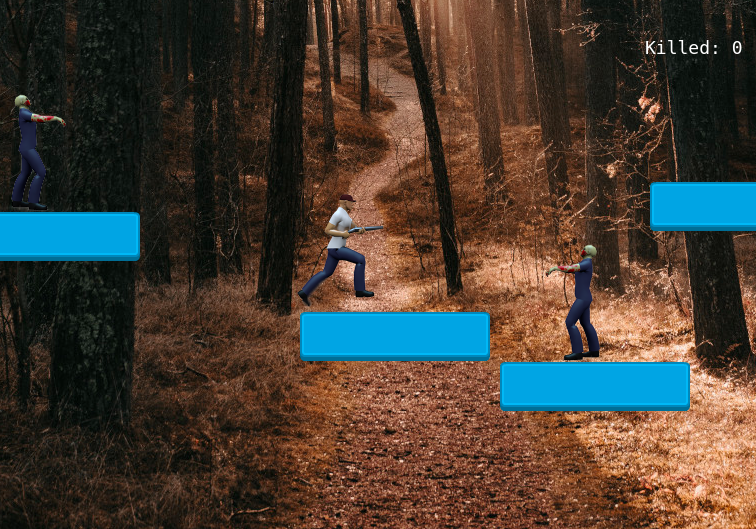

<h3 align="center">Capstone - Shooter Game</h3>

Shooter Game is a game that uses Phaser library to manipulate the player and enemies' movements and shoots. We can create different scenes, obstacles and logic for our enemies. This project uses Async, await to make calls to the LeaderBoard API, where name and scores are kept. I used Javascript, LeaderBoard API, Phaser 3, and Jest.

My expectations for this project

  The main idea when I started the project was to create a game where the player could defeat zombies. These zombies should chase the player and throw parts of their bodies towards the player to kill him. The player and zombies should have basic movements and not be static images.
  I wanted it to have more scenes, so the player who killed more zombies could pass to another scene, though it wasn't possible because of the deadline to deliver the project and I let this to the next releases.

## App Screenshot

## Live Link Demo

[Live Link Demo](https://fast-crag-38738.herokuapp.com/)

## Built With

- Phaser 3 
- JavaScript
- LeaderBoard API
- Jest

## Getting Started

To get a local copy up and running follow these simple example steps.

### Prerequisites

- Text Editor (VSCode is suggested.)

### Setup

- Install [git](https://git-scm.com/downloads)
- Open Terminal
- Change directory to folder to download repository
- Use `cd <file-path>`
- Run `git clone https://github.com/marcelomaidden/javascript-capstone-shooter-game`
- Install [Node.js](https://nodejs.org/en/download/)

To make any change,

- Open related file by using text editor.

## How to run your project locally

  - Change directory to javascript-capstone-shooter-game `cd javascript-capstone-shooter-game`
  - Install all project dependencies `npm install`
  - Run in your terminal `npm start` to start the game
  - Go to your preferred browser and open `localhost:8000`
  - Click the `Play` button and have fun

## Integration tests

  - In order to test the code run in your terminal `npm test`

## Game Controls

  - Player can move sidewards (right, left) by using the keys below:
  - `Left cursor key or A key to move to the left side`
  - `Right cursor key or D key to move to the right side`
  - `Up cursor key or W key to jump`
  - Space key is used to shoot towards the zombies

## Game story

  This game has only one scene where the player can move sidewards and jump.
  Zombies appear at random locations and throw their arms to defeat the player, so the player should always be moving and escape from them. You should kill as many zombies as possible because a score is kept for the ones who killed more zombies.  

## Author

👤  **Marcelo Fernandes**

- GitHub: [@marcelomaidden](https://github.com/marcelomaidden)
- Twitter: [@marcelomaidden](https://twitter.com/marcelomaidden)
- LinkedIn: [Marcelo Fernandes](https://linkedin.com/in/marcelofernandesdearaujo) 
## 🤝 Contributing

Contributions, issues and feature requests are welcome! Start by:

- Forking the project
- Cloning the project to your local machine
- `cd` into the project directory
- Run `git checkout -b your-branch-name`
- Make your contributions
- Push your branch up to your forked repository
- Open a Pull Request with a detailed description to the development branch of the original project for a review

## Show your support

Give a ⭐️ if you like this project!

## Acknowledgments

- Phaser 3 
- JavaScript
- Jest
- LeaderBoard API
- Kristaps Ungurs (background image)
- Unsplash
- Jorge Avila (Hero and zombie sprites)
- OpenGameArt

## 📝 License

This project is [MIT](LICENSE) licensed.
